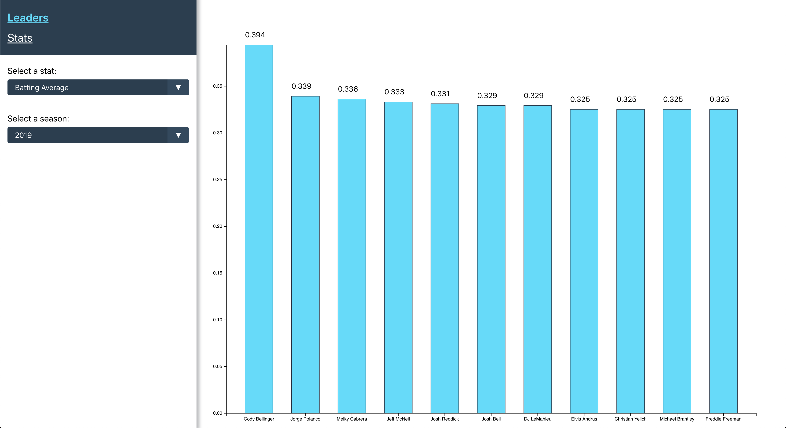
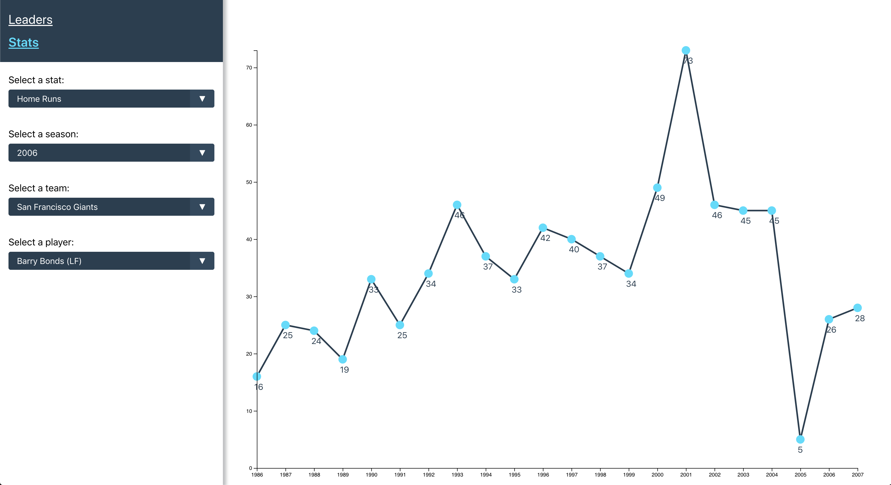

# Baseball Stat Graphs by Cole Voss

## Getting Started

#### Clone this repo:

```
$ git clone git@github.com:colevoss/opendorse-project.git
```

#### Install dependencies

```
$ npm install

or

$ yarn install
```

#### Run application:

```
$ npm start

or

$ yarn start
```

#### Open application in browser:

[localhost:3000](http://localhost:3000)

## About this project:

I chose to built a project dealing with MLB baseball stats. Using [this stats API](https://appac.github.io/mlb-data-api-docs/) I was able to put together two different stat charts.

This first chart you will see loads the top 10-12 leaders in the selected season and batting stat into a bar graph. Try clicking and hovering on a bar to toggle the corresponding data.



Navigating to the Stats page, you can choose a stat, season, team, and player to load stats for. Once a player is chosen, the stats for their entire career will be displayed on a line graph. You can easily switch the stat you want to display for the selected player and the graph will update immediately. Try clicking and hovering on a circle to toggle the corresponding data.



## About the Tech:

This project was bootstrapped using `create-react-app`. I chose this because it was the quickest way to get to writing a React application. I am experienced in setting up a web application using webpack and other technologies, but I figured this project did not need such a robust set up.

You will notice the heavy use of React hooks. I am a big fan of the new Hooks API and had a great time using them in this project. While I used `react-redux`'s `useSelect`, and `useDispatch` hooks, I am very familiar with their standard api of using `mapStateToProps`, `mapDispatchToProps`, and `connect`.

I used `redux-thunk` for asynchronous redux actions along with a custom action creator specifically for async actions. (See [createAsyncAction.js](src/state/createAsyncAction.js)).
